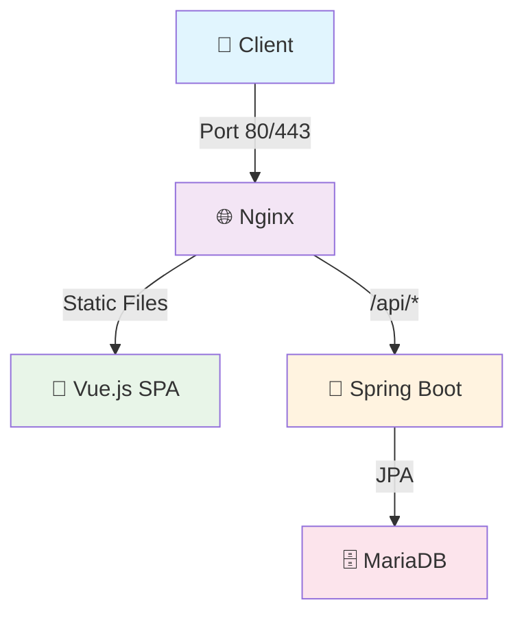

# 🚀 Flow Project

**파일 확장자 차단 관리 및 업로드 시스템**

Spring Boot + Vue.js + Nginx를 사용한 풀스택 웹 애플리케이션 (모노레포 구조)

---

## 📋 프로젝트 개요

**Flow_Task**는 파일 확장자를 체계적으로 관리하고 안전한 파일 업로드를 제공하는 웹 애플리케이션입니다.

### 🎯 주요 목표
- **보안 강화**: 위험한 파일 확장자 차단으로 시스템 보안 향상
- **유연한 관리**: 고정/커스텀 확장자 분리로 효율적인 관리
- **직관적 UI**: 사용자 친화적인 인터페이스로 쉬운 설정
- **모던 아키텍처**: 최신 기술 스택으로 확장 가능한 구조

---

## 🌟 핵심 기능

### 📚 확장자 관리 시스템
- **🔒 고정 확장자**: 시스템 기본 제공 (bat, cmd, com, cpl, exe, js, scr)
- **⚙️ 커스텀 확장자**: 사용자 정의 확장자 추가/삭제
- **🧪 실시간 테스트**: 확장자 차단 여부 즉시 확인
- **🔄 토글 제어**: 개별 확장자 활성화/비활성화

### 📁 파일 업로드 & 관리
- **🎯 드래그 앤 드롭**: 직관적인 파일 업로드
- **🛡️ 확장자 검증**: 업로드 전 자동 차단 확인
- **📊 파일 관리**: 업로드된 파일 조회/다운로드/삭제
- **⚡ 실시간 진행률**: 업로드 상태 실시간 모니터링

---

## 🏗️ 프로젝트 구조

```
flow/                           # 모노레포 루트
├── 📁 flow_backend/           # Spring Boot API 서버
│   ├── src/main/java/flow/
│   │   ├── 🔧 common/         # 공통 설정 & 유틸리티
│   │   ├── 📂 domain/         # 도메인별 패키지
│   │   │   ├── extension/     # 확장자 관리 도메인
│   │   │   └── file/          # 파일 관리 도메인
│   │   └── 📋 Application.java
│   ├── build.gradle
│   └── Dockerfile
│
├── 🎨 flow_frontend/          # Vue.js SPA 클라이언트
│   ├── src/
│   │   ├── 🧩 components/     # Vue 컴포넌트
│   │   │   ├── common/        # 공통 컴포넌트
│   │   │   └── extensions/    # 확장자 관련 컴포넌트
│   │   ├── 📄 views/          # 페이지 컴포넌트
│   │   ├── 🗃️ stores/         # Pinia 상태 관리
│   │   ├── 🛣️ router/         # Vue Router 설정
│   │   └── 📡 api/            # API 통신 모듈
│   ├── package.json
│   └── Dockerfile
│
├── 🌐 flow_nginx/             # Nginx 리버스 프록시
│   ├── nginx.conf
│   └── Dockerfile.nginx
│
├── 🐳 docker-compose.yml      # 전체 서비스 오케스트레이션
└── 📖 README.md
```

---

## 🛠️ 기술 스택

### 🔧 Backend (Spring Boot)
- **Framework**: Spring Boot 3.5.5
- **Language**: Java 21
- **Database**: MariaDB 11.2
- **Build Tool**: Gradle 8.x
- **Libraries**:
  - Spring Data JPA (데이터 액세스)
  - Spring Validation (입력 검증)
  - Spring Actuator (모니터링)
  - Lombok (코드 간소화)

### 🎨 Frontend (Vue.js)
- **Framework**: Vue.js 3.5.18 (Composition API)
- **Router**: Vue Router 4.5.1
- **State Management**: Pinia 3.0.3
- **Build Tool**: Vite 7.0.6
- **HTTP Client**: Axios 1.7.9
- **Testing**:
  - Vitest 3.2.4 (단위 테스트)
  - Playwright 1.49.1 (E2E 테스트)
  - @vue/test-utils 2.4.6 (컴포넌트 테스트)

### 🔄 DevOps & Infrastructure
- **Containerization**: Docker + Docker Compose
- **Reverse Proxy**: Nginx
- **Code Quality**: ESLint + Prettier
- **Package Manager**: pnpm (Frontend), Gradle (Backend)

---

## 📡 API 명세

### 🔒 확장자 관리 API

| Method | Endpoint | 설명 |
|--------|----------|------|
| `GET` | `/api/extensions/fixed` | 고정 확장자 목록 조회 |
| `POST` | `/api/extensions/fixed` | 고정 확장자 추가 |
| `PUT` | `/api/extensions/fixed` | 고정 확장자 상태 토글 |
| `DELETE` | `/api/extensions/fixed/{id}` | 고정 확장자 삭제 |
| `POST` | `/api/extensions/fixed/reset` | 고정 확장자 초기화 |
| `GET` | `/api/extensions/custom` | 커스텀 확장자 목록 조회 |
| `POST` | `/api/extensions/custom` | 커스텀 확장자 추가 |
| `DELETE` | `/api/extensions/custom/{id}` | 커스텀 확장자 삭제 |
| `DELETE` | `/api/extensions/custom/all` | 커스텀 확장자 전체 삭제 |
| `GET` | `/api/extensions/check/{ext}` | 확장자 차단 여부 확인 |
| `GET` | `/api/extensions/type/{ext}` | 확장자 타입 확인 |

### 📁 파일 관리 API

| Method | Endpoint | 설명 |
|--------|----------|------|
| `POST` | `/api/files/upload` | 파일 업로드 |
| `GET` | `/api/files` | 파일 목록 조회 |
| `GET` | `/api/files/{id}` | 특정 파일 정보 조회 |
| `GET` | `/api/files/{id}/download` | 파일 다운로드 |
| `DELETE` | `/api/files/{id}` | 파일 삭제 |

---

## 🚀 빠른 시작

### 📋 사전 요구사항

- **Docker & Docker Compose**: 컨테이너 실행 환경
- **pnpm**: Frontend 패키지 관리 (로컬 개발시)
- **Java 21**: Backend 로컬 개발시
- **Node.js 20.19.0+**: Frontend 로컬 개발시

### 🐳 Docker 배포 (권장)

```bash
# 1. 저장소 클론
git clone <repository-url>
cd flow

# 2. 전체 스택 실행
docker-compose up -d

# 3. 서비스 확인
docker-compose ps

# 🌐 접속: http://localhost
```

### 💻 로컬 개발 환경

#### Backend 실행
```bash
cd flow_backend
./gradlew bootRun
# 🔗 API 서버: http://localhost:8080
```

#### Frontend 실행
```bash
cd flow_frontend
pnpm install
pnpm dev
# 🎨 개발 서버: http://localhost:5173
```

---

## 🔗 서비스 구성 & 네트워크

### 📊 포트 구성

| 서비스 | 개발 포트 | 프로덕션 포트 | 역할 |
|--------|-----------|---------------|------|
| **Nginx** | - | 80, 443 | 리버스 프록시 |
| **Frontend** | 5173 | - | Vue.js SPA |
| **Backend** | 8080 | 8080 | Spring Boot API |
| **MariaDB** | 3306 | 3306 | 데이터베이스 |

### 🌐 네트워크 플로우



---

## 📱 Frontend 상세 기능

### 🧩 컴포넌트 구조

#### 📄 페이지 (Views)
- **🏠 HomeView**: 확장자 관리 메인 페이지
- **📤 UploadView**: 파일 업로드 관리 페이지

#### 🔧 공통 컴포넌트
- **📝 InputField**: 재사용 가능한 입력 필드
- **🔘 ToggleButton**: 시각적 토글 스위치

#### 🎯 확장자 관리 컴포넌트
- **🔒 FixedExtensions**: 고정 확장자 관리
- **⚙️ CustomExtensions**: 커스텀 확장자 관리
- **🧪 ExtensionTest**: 확장자 테스트 도구

### 🗃️ 상태 관리 (Pinia)

#### 📂 Extension Store
```javascript
// 주요 액션들
loadFixedExtensions()       // 고정 확장자 목록 조회
toggleFixedExtension()      // 차단/허용 토글
addFixedExtension()         // 새 확장자 추가
deleteFixedExtension()      // 확장자 삭제
resetFixedExtensions()      // 기본 상태 초기화

loadCustomExtensions()      // 커스텀 목록 조회
addCustomExtension()        // 커스텀 추가
deleteCustomExtension()     // 개별 삭제
deleteAllCustomExtensions() // 전체 삭제

checkExtension()            // 차단 여부 확인
getExtensionType()          // 타입 확인
unblockExtension()          // 차단 해제
```

#### 📁 File Store
```javascript
// 파일 관리 액션들
uploadFile()                // 파일 업로드
loadFiles()                 // 파일 목록 조회
downloadFile()              // 파일 다운로드
deleteFile()                // 파일 삭제
checkFileExtension()        // 확장자 검증
```

### 📱 반응형 디자인

| 디바이스 | 브레이크포인트 | 특징 |
|----------|----------------|------|
| 🖥️ **Desktop** | 1200px+ | 최적화된 그리드 레이아웃 |
| 📱 **Tablet** | 768px-1199px | 적응형 컬럼 구조 |
| 📱 **Mobile** | 767px 이하 | 세로 스택 레이아웃 |

---

## ⚙️ Backend 상세 기능

### 🏗️ 아키텍처 패턴
- **Domain-Driven Design**: 도메인별 패키지 구조
- **Layered Architecture**: Controller → Service → Repository
- **RESTful API**: 표준 REST 원칙 준수

### 📂 도메인 구조

#### 🔒 Extension Domain
```
extension/
├── 📄 entity/
│   ├── FixedExtension.java     # 고정 확장자 엔티티
│   └── CustomExtension.java    # 커스텀 확장자 엔티티
├── 📝 dto/
│   ├── FixedExtensionRequest.java
│   ├── FixedExtensionResponse.java
│   ├── CustomExtensionRequest.java
│   └── CustomExtensionResponse.java
├── 🗃️ repository/
│   ├── FixedExtensionRepository.java
│   └── CustomExtensionRepository.java
├── ⚙️ service/
│   ├── ExtensionService.java
│   └── ExtensionServiceImpl.java
└── 🔗 controller/
    └── ExtensionController.java
```

#### 📁 File Domain
```
file/
├── 📄 entity/
│   └── FileEntity.java
├── 📝 dto/
│   └── FileResponse.java
├── 🗃️ repository/
│   └── FileRepository.java
├── ⚙️ service/
│   ├── FileService.java
│   └── FileServiceImpl.java
└── 🔗 controller/
    └── FileController.java
```

### 🛡️ 보안 & 예외처리
- **Global Exception Handler**: 통합 예외 처리
- **Business Exception**: 커스텀 비즈니스 예외
- **Response API**: 표준화된 응답 구조
- **CORS 설정**: 클라이언트-서버 간 통신 허용

---

## 🧪 테스트 & 품질관리

### 🎯 Frontend Testing

```bash
# 단위 테스트
pnpm test:unit

# E2E 테스트
pnpm test:e2e

# 테스트 커버리지
pnpm test:coverage

# 코드 린팅
pnpm lint

# 코드 포매팅
pnpm format
```

### 🔍 Backend Testing

```bash
# 단위 테스트
./gradlew test

# 테스트 리포트
./gradlew test jacocoTestReport

# 빌드 검증
./gradlew build
```

---

## 🐳 Docker 환경

### 📦 서비스 컨테이너

| 서비스 | 이미지 | 포트 | 볼륨 |
|--------|--------|------|------|
| **nginx** | Custom Nginx | 80:80, 443:443 | nginx.conf |
| **flow_frontend** | Node.js Alpine | - | 빌드된 정적 파일 |
| **flow_backend** | OpenJDK 21 | 8080:8080 | 업로드 파일, 로그 |
| **mariadb** | MariaDB 11.2 | 3306:3306 | DB 데이터 |

### 🔧 Docker 명령어

```bash
# 전체 스택 시작
docker-compose up -d

# 특정 서비스만 시작
docker-compose up -d mariadb flow_backend

# 서비스 상태 확인
docker-compose ps

# 로그 확인
docker-compose logs -f flow_backend

# 전체 스택 중지
docker-compose down

# 볼륨 포함 완전 삭제
docker-compose down -v
```

---

## 🎨 디자인 시스템

### 🎨 색상 팔레트
```css
/* Primary Colors */
--color-primary: #374151
--color-secondary: #6b7280
--color-tertiary: #9ca3af

/* Status Colors */
--color-success: #166534, #dcfce7
--color-warning: #92400e, #fef3c7
--color-error: #dc2626, #fee2e2
```

### 📋 개발 가이드라인

1. **브랜치 전략**
   - `main`: 프로덕션 배포

2. **커밋 컨벤션**
   ```
   feat: 새로운 기능 추가
   fix: 버그 수정
   docs: 문서 수정
   style: 코드 포매팅
   refactor: 코드 리팩토링
   test: 테스트 추가/수정
   chore: 빌드 설정 등
   ```
---

📅 Last Updated: January 2025

</div>
